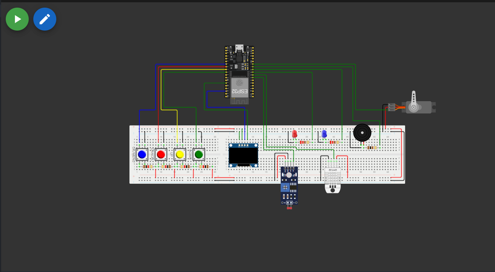
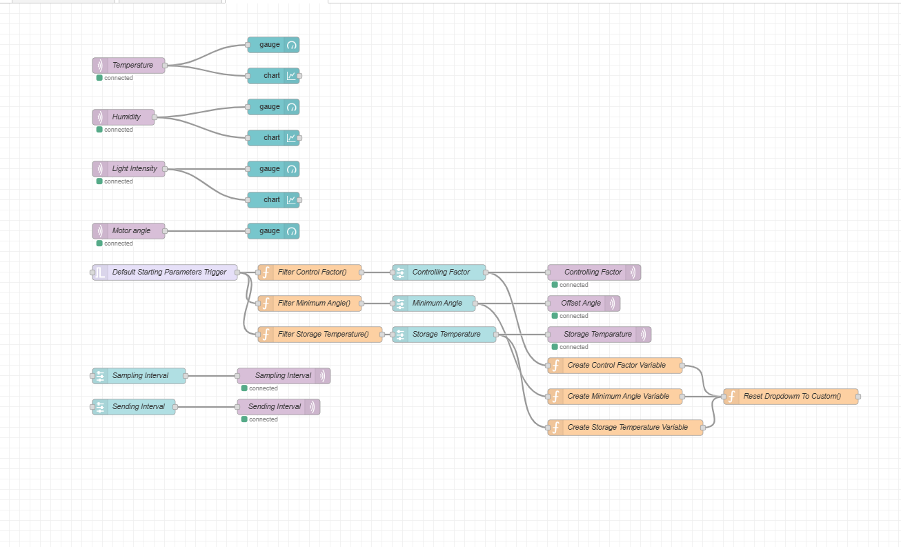

# Smart Medi Box - Medication Management System-part 02 💊




This is my implementation of the **Smart Medibox** for  EN2853 - Embedded Systems & Applications module`  

The Medibox helps users manage **medication schedules** and improve **medicine storage safety** by monitoring **light intensity** and **temperature**, while adjusting a **servo-controlled sliding window** to keep medicines in safe conditions.

---

## Features

1. **Light Intensity Monitoring**
   - Measures light inside the box using **LDR sensors**.  
   - Samples values every **ts seconds** (default: 5s).  
   - Sends **averaged values** to Node-RED dashboard every **tu minutes** (default: 2 min).  
   - Values are normalized between `0` (dark) and `1` (bright).  

2. **Servo-Controlled Sliding Window**
   - Servo motor adjusts between **0°–180°**.  
   - Position depends on light intensity + temperature.  
   - Prevents direct sunlight from spoiling medicines.  

3. **Temperature Monitoring**
   - Uses **DHT11 sensor** for temperature readings.  
   - Ideal storage temperature (`Tmed`) is user-configurable.  

4. **Dynamic Configuration (via Node-RED)**
   - Sampling interval `ts` (seconds).  
   - Data sending interval `tu` (seconds/minutes).  
   - Minimum servo angle (`θoffset`) [0°–120°].  
   - Controlling factor (`γ`) [0–1].  
   - Ideal medicine temperature (`Tmed`) [10°C–40°C].  

---

## Components & Technologies

- **ESP32 Devkit V1**  
- **DHT11 Sensor** (Temperature & Humidity)  
- **LDR Sensors** + Resistors  
- **SG90 Servo Motor**  
- **Node-RED** (Dashboard + MQTT broker `test.mosquitto.org`)  
- **PlatformIO / Arduino Framework**  


## Motor Angle Calculation

The servo motor angle `θ` is calculated as:

$$θ = θ_{offset} + (180 - θ_{offset}) × I × γ × \ln \left(\frac{t_s}{t_u}\right) × \frac{T_{med}}{T}$$

Where:  

| Symbol | Description |
|--------|-------------|
| `θ` | Servo motor angle |
| `θoffset` | Minimum servo angle (default = 30°) |
| `I` | Light intensity (normalized 0–1) |
| `γ` | Controlling factor (default = 0.75) |
| `ts` | Sampling interval (seconds) |
| `tu` | Sending interval (seconds/minutes) |
| `T` | Current measured temperature (°C) |
| `Tmed` | Ideal medicine storage temperature (°C, default = 30°C) |

---

## Getting Started

### Prerequisites
- [Git](https://git-scm.com/)  
- [VS Code](https://code.visualstudio.com/) + [PlatformIO](https://platformio.org/)  
- [Node-RED](https://nodered.org/) installed  
- MQTT broker (default: [test.mosquitto.org](https://test.mosquitto.org))

## Medibox Setup
*   Clone the repository.
    ```bash 
    git clone https://github.com/shehanp-dev/Smart-Medibox.git   
    ```

 >[!IMPORTANT]<br>
> If you are willing to simulate the project using Wokwi extension, then clone the relavant branch using this, instead. (Or you can switch branches later.)
>    ```bash 
>     git clone -b Wokwi https://github.com/shehanp-dev/Smart-Medibox.git   
>  ```


* Typically platform I/O will install required libraries itself. If not you have to install them referring the [`platform.ini`](#platform.ini)
 file displayed above.

* Compile and Upload/Simulate.

## Visualization  

### 🔹 Wokwi Simulation  
  

### 🔹 Node-RED Flow  
  

### 🔹 Node-RED Dashboard  
  
"# Smart-MediBox-Part-02" 
"# Smart-Medibox_02" 
